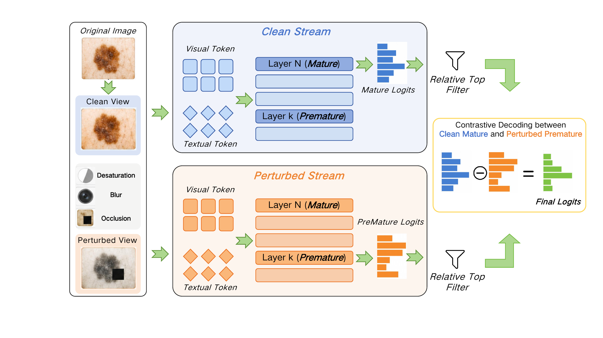

# SkinCD


Official implementation of **SkinCD: Cross-View Layer-Contrast Decoding for Reliable Skin Disease Classification with MLLMs**, accepted as a regular paper at **PRICAI 2026**.

Authors: Zi Yu Wang, Xue Wu Zhang, Chang Xu, and Fei Qi.

[[Code](https://github.com/wangziyu8080-svg/SkinCD)] · [Paper: coming soon]

## Overview

SkinCD is a training-free decoding framework for improving the reliability of skin-disease classification with multimodal large language models. It runs clean and perturbed lesion views in parallel, contrasts mature clean logits with unstable premature perturbed logits, and uses relative-top filtering and candidate-class scoring to suppress weakly grounded predictions without retraining the model.



## Abstract

Multimodal Large Language Models (MLLMs) combine lesion-image understanding with natural-language interaction, but their predictions can become visually inconsistent when dermatological morphology is subtle or ambiguous. SkinCD addresses this problem with a training-free cross-view layer-contrast decoding framework. It processes a clean lesion branch and a perturbed lesion branch in parallel, extracts mature logits from a deep clean layer and unstable logits from an earlier perturbed layer, and applies scaled contrast to suppress weakly grounded class evidence while preserving mature visual-language signals. A classification-oriented inference recipe further specifies perturbation construction, premature-layer selection, relative-top filtering, and length-normalized class scoring. SkinCD is plug-and-play, requires no model retraining or parameter updates, and improves reliability over strong decoding baselines on multiple dermatology benchmarks.

**Keywords:** Multimodal Large Language Models; Skin Disease Diagnosis; Contrastive Decoding; Reliable Inference.

## Repository structure

```text
SkinCD/
├── experiments/
│   ├── cd_scripts/                 # Reproducible experiment entry points
│   ├── eval/                       # Classification and POPE evaluation
│   ├── qwen2_5_vl/                 # Qwen2.5-VL integration
│   ├── llava/, Qwen_VL/, lavis/    # Baseline model integrations
│   └── run_multidataset_dola_vola.sh
├── vcd_utils/                      # Contrastive decoding and perturbations
├── figs/                           # Project figures
├── DATASET_PREP.md                 # Dataset sources and expected layout
└── requirements.txt
```

## Installation

Create an isolated Python environment, then install the dependencies:

```bash
conda create -n skincd python=3.10 -y
conda activate skincd
pip install -r requirements.txt
```

The Qwen2.5-VL path requires a Transformers release that provides `Qwen2_5_VLForConditionalGeneration`. If your environment uses the legacy baseline pins in `requirements.txt`, install a compatible recent Transformers/Qwen2.5-VL stack before running the Qwen2.5-VL experiments.

## Data preparation

Download each dataset from its official source and arrange it under one local data root. See [DATASET_PREP.md](DATASET_PREP.md) for sources and examples. Dataset files and model checkpoints are not distributed in this repository.

For HAM10K, set the CSV and image-root paths explicitly:

```bash
export HAM10K_DATA_FILE=/path/to/HAM10K_ISIC2018_test.csv
export HAM10K_IMAGE_ROOT=/path/to/datasets
```

The CSV must provide the image path and ground-truth label columns consumed by `experiments/eval/classification.py`.

## Running SkinCD

The main HAM10K entry point accepts the random seed, model path, contrast weight, plausibility threshold, noise step, and decoding method:

```bash
CUDA_DEVICES=0 \
HAM10K_DATA_FILE=/path/to/HAM10K_ISIC2018_test.csv \
HAM10K_IMAGE_ROOT=/path/to/datasets \
bash experiments/cd_scripts/qwen2_5_ham10k.sh \
  55 Qwen/Qwen2.5-VL-7B-Instruct 1.0 0.1 500 vcd
```

Supported contrast-view methods include `vcd`, `color`, `boundary_blur`, `texture_blur`, `occlusion`, and `skin_morph`. The evaluation code also exposes layer-contrast variants through `dola` and `vola`.

Run the base model without contrastive decoding:

```bash
USE_CD=0 \
HAM10K_DATA_FILE=/path/to/HAM10K_ISIC2018_test.csv \
HAM10K_IMAGE_ROOT=/path/to/datasets \
bash experiments/cd_scripts/qwen2_5_ham10k.sh \
  55 Qwen/Qwen2.5-VL-7B-Instruct
```

Outputs are written to `experiments/output/`.

## Citation

If this repository is useful in your research, please cite the SkinCD paper. The final proceedings BibTeX, DOI, and page information will be added after Springer publishes the proceedings metadata. GitHub users can also select **Cite this repository** using the included `CITATION.cff` file.

```text
Zi Yu Wang, Xue Wu Zhang, Chang Xu, and Fei Qi.
SkinCD: Cross-View Layer-Contrast Decoding for Reliable Skin Disease
Classification with MLLMs. PRICAI 2026. To appear.
```

## Acknowledgements

This repository contains integrations derived from or compatible with open-source components from Hugging Face Transformers, Qwen, LLaVA, LAVIS, and visual contrastive decoding implementations. Please follow the licenses and model terms of the corresponding upstream projects.

## License

Released under the [Apache License 2.0](LICENSE). Third-party components retain their original notices and licenses.
